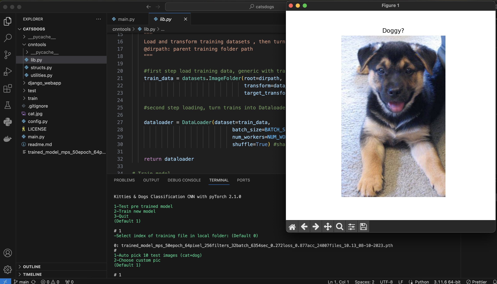

#License MIT

Roy Massaad 2023

#Description

CNN Image binary classification network sample using Pytorch
Train and test with cli (tooling lib placed in cnntools folder)
Cat Dog Dataset included from Kaggle 
https://www.kaggle.com/datasets/shaunthesheep/microsoft-catsvsdogs-dataset/data

#Main Module

main.py, config.py, and the neural tensor processing files in **cnntools** folder, using Pytorch
Default network has 3 convolution layers and 2 linear fully connected layers
check/edit hyperparameters in config.py
CNN is in structs.py

#Side Module

A Django webapp folder where you can take a photo or upload from gallery and have the CNN classify it
This side project can be deployed online, it has its own duplicate **cnntools** folder inside it and a saved model trained file to use "trained_model_xxx.pth". 
Default password to upload the form image is 'pass123' (change it if deployed online)

#Requirements

* Python 3.x (tested on Python 3.11)

* Pytorch 1.x+ (tested on Pytorch 2 with cpu, cuda and mps)

* climage
* numpy
* matplotlib
* torchvision
* tqdm

For testing use PyTest